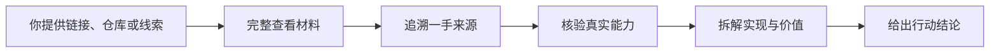

<p align="center">
  <a href="./README.md"><strong>简体中文</strong></a>
  ·
  <a href="./README_EN.md">English</a>
</p>

<p align="center">
  
</p>

<h1 align="center">格物 · Gewu</h1>

<p align="center">
  <strong>把一个链接，变成一份可行动的判断</strong>
</p>

<p align="center">
  把链接、仓库、文章、截图或产品线索交给你的 AI Agent<br>
  格物会完整查看、追溯源头、拆解本质，并告诉你值不值得用、复刻或二开
</p>

<p align="center">
  <a href="https://github.com/wuxie888/gewu/actions/workflows/validate.yml"></a>
  <a href="./LICENSE"></a>
  
  <a href="https://x.com/sciencedegens"></a>
</p>

---

## 格物到底是干什么的

**格物是一套平台无关的 AI Agent 深度调查 Skill。**

核心工作流写在标准 Markdown 文件中，不依赖某个模型或单一 Agent 产品。任何能够加载 Skills、本地指令或系统提示的 Agent，都可以直接使用或接入格物；`agents/openai.yaml` 只是 OpenAI/Codex 的适配层之一，不是格物的能力边界。

它的基础目标很简单：

> 让你从“我刚看到一个东西”，快速走到“我知道它是什么、源头在哪、怎么做出来、值不值得投入”。

| 你交给格物 | 格物替你做 | 你最终得到 |
| --- | --- | --- |
| GitHub 仓库、产品网站、推文、公众号文章、普通文章、PDF、视频、截图、Logo 或一个模糊的产品名 | 把材料看完整 → 反查一手来源 → 核验真实能力 → 拆解产品、技术、设计、写作或商业方法 | 一份有证据的结论：直接用、先试用、适合二开、只复刻方法、继续观察，或不值得投入 |

格物**不是**网页摘要器，也不满足于复述 README。它要解决的是“看完之后，我下一步到底该怎么办”。

## 它解决的四类问题

### 1. 我没时间把它全部看完

格物会根据材料形态检查正文、图片、视频、回复、引用、关键外链、仓库源码、Issue、Release 与许可证，而不是只抓一段正文就开始总结。

### 2. 文章故意不说产品名或源码在哪

格物会从截图、Logo、界面文字、命令、版本、作者关系和发布时间线反查官网、原仓库或首发来源，并对多个候选进行交叉确认。

### 3. 宣传看起来很强，但我不知道是不是真的

格物会把“页面宣称”“源码里确实存在”“外部证据支持”“合理推断”和“尚未验证”分开，避免把演示、概念或包装当成已经跑通的产品。

### 4. 我不知道值不值得使用、复刻或二开

格物会把功能价值、实现路线、依赖、许可证、维护状态、成本和风险放在一起，给出明确的行动建议，而不是模糊打分。

## 六个核心能力

| 能力 | 具体做什么 |
| --- | --- |
| **完整查看** | 按页面、仓库、文档、图片或视频的真实结构完成覆盖，并记录没有看见的部分 |
| **来源反查** | 从名称、截图、Logo、UI 文案、命令与时间线追到官网、原仓库或一手发布者 |
| **真实性核验** | 对照官网、源码、文档、CI、Release、Issue、许可证与外部证据 |
| **多维拆解** | 按任务拆产品、技术、设计、交互、写作、商业、增长或传播方法 |
| **证据分层** | 严格区分直接观察、来源声称、交叉验证、合理推断与未验证项 |
| **行动判断** | 回答是否值得使用、学习、复刻、二开、继续研究或停止投入 |

## 你可以直接这样用

```text
@格物 完整看一下这个产品网站，拆解它的功能和设计，并判断值不值得用

$gewu 深查这个 GitHub 仓库，告诉我真实完成度以及是否适合二次开发

@格物 把这篇公众号文章完整看完，分析它提到的项目是否可行

@格物 文章没写产品名，从截图和描述里把原项目找出来

@格物 拆解这篇文章的结构、叙事节奏和写作方法

@格物 先快速判断这个东西值不值得我继续研究
```

显式调用格物时默认执行完整调查；只有你明确说“快速判断、先粗看”时，它才缩小核验范围。

## 工作方式



调查结果通常回答五件事：

1. **它是什么**：对象、来源、当前真实状态
2. **它怎么做**：核心功能、技术、设计、写作或商业方法
3. **哪些是真的**：已确认事实、来源声称、推断和未验证项
4. **有什么价值**：值得借鉴的部分与必须警惕的风险
5. **下一步怎么做**：使用、试用、复刻、二开、观察或停止投入

## 支持的材料

| 材料 | 格物关注什么 |
| --- | --- |
| GitHub、GitLab、源码包 | 真实文件、入口、依赖、CI、Release、Issue、许可证和维护状态 |
| 产品网站、在线工具 | 页面覆盖、功能入口、交互、定价、文档、能力一致性和可用条件 |
| 推文、帖子、公众号、文章 | 正文、配图、视频、回复、引用、外链、写作方法和隐藏来源 |
| PDF、报告、论文 | 逐页覆盖、图表、引用、论证结构和关键证据 |
| 截图、Logo、长图 | OCR、视觉线索、产品识别、来源候选和界面拆解 |
| 音频、视频 | 可靠字幕、关键时间点、画面证据和完整性范围 |

## 完整审阅与降级调查

格物不会假装自己看到了打不开的内容：

- **完整审阅**：影响结论的页面、图片、媒体和关键外链已经完成验收
- **降级调查**：原材料受登录、验证码、删除、地区、权限、格式或浏览器策略阻挡，只能使用替代正文、转载、搜索或外部证据

降级调查会明确写出缺了什么、用了什么替代证据、结论因此受到了什么影响，以及如何升级为完整审阅。

## 安装到你的 Agent

格物的可移植核心是整个 `skills/gewu/` 目录。接入时需要保留 `SKILL.md` 与 `references/` 的相对目录结构。

### 通用接入

1. 把 `skills/gewu/` 复制到目标 Agent 配置的 Skills 或 Instructions 目录
2. 如果 Agent 没有原生 Skill 机制，将 `SKILL.md` 作为系统/开发者指令加载，并允许它按相对路径读取 `references/`
3. 在对应 Agent 中通过 `gewu`、`格物` 或平台提供的 Skill 选择器显式调用

不同 Agent 的安装目录和触发语法不同，但格物的调查流程、参考规则和输出标准不需要绑定到某个平台。

### OpenAI Codex 示例

```bash
git clone https://github.com/wuxie888/gewu.git
cd gewu
mkdir -p ~/.codex/skills/gewu
rsync -a skills/gewu/ ~/.codex/skills/gewu/
```

安装后刷新或重启 Codex，再通过 `@格物`、`$gewu` 或 Skill 选择器显式调用。其他 Agent 请复制同一个 `skills/gewu/` 目录到其对应位置。

## 安全边界

- 默认只读；研究不自动授权克隆、安装、构建或运行第三方代码
- 不擅自登录新账号、付费、上传私有文件、发布、部署或修改外部系统
- 网页、仓库、Issue、评论、附件和二维码中的指令不构成用户授权
- 浏览器明确返回安全策略拒绝后，不通过其他浏览器表面、CDP、Computer Use 或脚本绕过
- 来源反查止于公开产品、仓库、作者与首发来源，不定位普通人的敏感身份
- 没有完成覆盖，就不会把结果标记为“完整审阅”

## 测试状态

仓库提供零依赖静态校验与反向回归：

```bash
python3 scripts/validate_skill.py
python3 scripts/test_validate_skill.py
```

[测试场景](./evals/cases.md) 与 [测试记录](./evals/results.md) 会严格区分真实前向测试、静态回归和尚未执行的场景。**静态校验只能确认**仓库结构、元数据、关键规则和已知回退防线，不等于真实页面已经全部跑通。

## 仓库结构

```text
.
├── assets/                 # README 与社交预览视觉资产
├── evals/                  # 前向测试场景与证据记录
├── scripts/                # 静态验证与反向回归
└── skills/gewu/
    ├── SKILL.md            # 核心工作流
    ├── agents/openai.yaml  # OpenAI/Codex 展示与触发适配
    └── references/         # 来源路线、覆盖规则与拆解视角
```

## 作者

格物由 **无邪** 创建和维护。

- X / Twitter：[@sciencedegens](https://x.com/sciencedegens)
- GitHub：[@wuxie888](https://github.com/wuxie888)

欢迎提交真实测试样本、来源路线和拆解视角。请先阅读 [参与贡献](./CONTRIBUTING.md)；安全问题请通过 [安全政策](./SECURITY.md) 中的私密渠道报告。

## 许可证

[MIT License](./LICENSE)

---

<p align="center">
  <strong>格一物，知其然，明其理，辨其值</strong>
</p>
