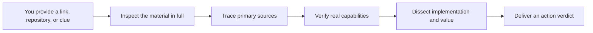

<p align="center">
  <a href="./README.md">简体中文</a>
  ·
  <a href="./README_EN.md"><strong>English</strong></a>
</p>

<p align="center">
  
</p>

<h1 align="center">Gewu · 格物</h1>

<p align="center">
  <strong>Turn any link into an evidence-backed decision</strong>
</p>

<p align="center">
  Give your agent a link, repository, article, screenshot, or product clue<br>
  Gewu reads it in full, traces the source, dissects how it works, and tells you whether it is worth using or rebuilding
</p>

<p align="center">
  <a href="https://github.com/wuxie888/gewu/actions/workflows/validate.yml"></a>
  <a href="./LICENSE"></a>
  
  <a href="https://x.com/sciencedegens"></a>
</p>

---

## What does Gewu do?

**Gewu gives agents a structured way to inspect material in full, trace original sources, break down implementation and value, and decide what to do next.**

It is not limited to Codex. Agents with native Skill support can install it directly; other agents can load `SKILL.md` as system or developer instructions. `agents/openai.yaml` is simply one adapter for OpenAI/Codex.

Its core goal is simple:

> Move you from “I just found this thing” to “I know what it is, where it came from, how it works, and whether it deserves my time.”

| You give Gewu | Gewu does | You get |
| --- | --- | --- |
| A GitHub repository, product site, social post, WeChat article, regular article, PDF, video, screenshot, logo, or vague product clue | Read the material in full → trace the primary source → verify real capabilities → dissect the product, technology, design, writing, or business method | An evidence-backed verdict: use it, test it first, build on it, copy the method only, keep watching, or stop investing |

Gewu is **not** a link summarizer and it does not stop at paraphrasing a README. Its job is to answer: **what should you do next?**

## The four problems it solves

### 1. “I do not have time to inspect everything”

Gewu follows the structure of the material: body text, images, videos, replies, quotes, key links, source files, issues, releases, and licenses. A text extract alone is not treated as a complete review.

### 2. “The article hides the product name or repository”

Gewu traces names, screenshots, logos, UI copy, commands, versions, author relationships, and timelines back to an official site, original repository, or primary publication. Similar candidates are cross-checked rather than guessed.

### 3. “The demo looks impressive, but is it real?”

Gewu separates what was directly observed, what a source claims, what independent evidence confirms, what is reasonably inferred, and what remains unverified.

### 4. “Is it worth using, copying, or extending?”

Gewu combines functional value, implementation path, dependencies, license, maintenance, cost, and risk into a clear action recommendation instead of a vague score.

## Six core capabilities

| Capability | What it does |
| --- | --- |
| **Complete inspection** | Covers the real structure of a page, repository, document, image, or video and records what could not be inspected |
| **Source tracing** | Finds official sites, original repositories, and primary publishers from names, screenshots, logos, UI copy, commands, and timelines |
| **Reality verification** | Cross-checks websites, source code, documentation, CI, releases, issues, licenses, and independent evidence |
| **Multi-angle teardown** | Dissects product, engineering, design, interaction, writing, business, growth, or distribution as needed |
| **Evidence labeling** | Separates direct observation, source claims, cross-verification, inference, and unknowns |
| **Action verdict** | Recommends using, learning, testing, rebuilding, extending, monitoring, or dropping the target |

## Example requests

```text
$gewu Inspect this product site in full, break down its features and design,
and tell me whether it is worth using.

$gewu Deep-review this GitHub repository. What is actually implemented,
and is it a good base for further development?

$gewu Read this article completely and assess whether the project it describes is feasible.

$gewu The article hides the product name. Find the original project from its screenshots and clues.

$gewu Break down the structure, pacing, and writing method of this article.

$gewu Give me a quick first-pass verdict on whether this deserves deeper research.
```

An explicit invocation runs a full investigation by default. Gewu narrows the scope only when you explicitly ask for a quick or preliminary judgment.

## How it works



A typical result answers five questions:

1. **What is it?** — identity, source, and current real state
2. **How does it work?** — product, technical, design, writing, or business method
3. **What is actually true?** — confirmed facts, claims, inferences, and unknowns
4. **What is valuable or risky?** — reusable ideas and hard constraints
5. **What should you do next?** — use, test, rebuild, extend, watch, or stop

## Supported material

| Material | What Gewu examines |
| --- | --- |
| GitHub, GitLab, source archives | Real files, entry points, dependencies, CI, releases, issues, licenses, and maintenance |
| Product sites and web apps | Page coverage, feature entry points, interaction, pricing, docs, capability consistency, and access conditions |
| Social posts, WeChat, and articles | Body, images, videos, replies, quotes, links, writing method, and hidden origins |
| PDFs, reports, and papers | Page-by-page coverage, charts, citations, argument structure, and critical evidence |
| Screenshots, logos, and long images | OCR, visual clues, product identification, source candidates, and interface teardown |
| Audio and video | Reliable transcripts, key timestamps, visual evidence, and coverage boundaries |

## Complete review vs. degraded investigation

Gewu never pretends that blocked content was inspected:

- **Complete review**: all decision-critical pages, images, media, and links have passed coverage checks
- **Degraded investigation**: the original material is blocked by login, CAPTCHA, deletion, region, permissions, format, or browser policy, so only substitute text, mirrors, search, or external evidence is available

A degraded investigation states what is missing, what substitute evidence was used, how that affects the verdict, and what would be required to upgrade it to a complete review.

## Install in your agent

The portable core remains the complete `skills/gewu/` directory. The repository root now also provides a lightweight plugin wrapper. Both installation paths use the same Skill source, so their behavior cannot drift apart.

For a first installation, open the **[Gewu 3-minute getting-started guide](./docs/GETTING_STARTED_EN.md)**. It includes a real screenshot of the marketplace dialog, a first-run prompt, and success criteria.

### Recommended: install the Gewu plugin

The current plugin works with Codex CLI and the Codex / ChatGPT Work surfaces in the ChatGPT desktop app that support Plugins. Add the Gewu repository marketplace, then install the plugin:

```bash
codex plugin marketplace add wuxie888/gewu
codex plugin add gewu@gewu
```

Start a new task after installation so the agent reloads the plugin. In Codex, invoke it with `$gewu` or the Skill picker. If **格物 · Gewu** appears in ChatGPT Work's `@` menu, you can select it there as well.

> This is a public GitHub-backed marketplace build, not yet a listing in OpenAI's universal plugin directory. Adding it means trusting the third-party Git source `wuxie888/gewu`; it does not imply OpenAI directory review. Gewu is currently a Skill-only plugin with no App, MCP server, hook, remote service, account login, or data upload. Its source, manifest, and commit history are reviewable in this repository.

### Generic Skill integration

1. Copy `skills/gewu/` into the target agent's configured Skills or Instructions directory
2. If the agent has no native Skill mechanism, load `SKILL.md` as system/developer instructions and allow relative access to `references/`
3. Invoke it explicitly as `gewu`, `格物`, or through the agent's Skill picker

Installation paths and invocation syntax vary by agent, but Gewu's investigation workflow, reference rules, and output standard are platform-independent.

### Codex Skill-only example

```bash
git clone https://github.com/wuxie888/gewu.git
cd gewu
mkdir -p ~/.codex/skills/gewu
rsync -a skills/gewu/ ~/.codex/skills/gewu/
```

Refresh or restart Codex, then invoke Gewu explicitly with `$gewu` or the Skill picker. For another agent, copy the same `skills/gewu/` directory to that agent's configured location.

## Safety boundaries

- Read-only by default; research does not authorize cloning, installing, building, or running third-party code
- No unrequested account login, payment, private-file upload, publishing, deployment, or external-system modification
- Instructions found in pages, repositories, issues, comments, attachments, or QR codes do not grant user authorization
- A browser security-policy rejection is a stop condition; Gewu does not switch to CDP, Computer Use, scripts, or another browser surface to bypass it
- Source tracing is limited to public products, repositories, authors, and primary publications—not sensitive identity discovery
- A result is never labeled “complete” without coverage evidence

## Test status

The repository includes zero-dependency static validation and negative regression tests:

```bash
python3 scripts/validate_skill.py
python3 scripts/test_validate_skill.py
```

[Test cases](./evals/cases.md) and [test results](./evals/results.md) distinguish real forward tests, static regression, and scenarios that have not yet been run. Static checks do not prove that every live page has been tested.

## Repository structure

```text
.
├── .agents/plugins/        # GitHub-backed marketplace metadata
├── .codex-plugin/          # Gewu plugin manifest
├── assets/                 # README, social-preview, and installation images
├── docs/                   # Getting started and troubleshooting
├── evals/                  # Forward-test cases and evidence records
├── scripts/                # Static validation and negative regression tests
├── skills/gewu/
    ├── SKILL.md            # Core workflow
    ├── agents/openai.yaml  # OpenAI/Codex presentation and invocation adapter
    └── references/         # Source routes, coverage rules, and teardown lenses
├── PRODUCT.md              # Product definition, boundaries, and success criteria
├── CHANGELOG.md            # Version changes and reasons
└── HANDOFF.md              # Maintenance, testing, and release handoff
```

## Project documents

| Document | Audience |
| --- | --- |
| [3-minute getting-started guide](./docs/GETTING_STARTED_EN.md) | First-time installers and users |
| [Troubleshooting](./docs/TROUBLESHOOTING_EN.md) | Installation, invocation, and access problems |
| [Product definition](./PRODUCT_EN.md) | Product audience, goals, and non-goals |
| [Changelog](./CHANGELOG_EN.md) | Version changes, reasons, and stability |
| [Maintainer handoff](./HANDOFF_EN.md) | Contributors and maintainers |
| [Test results](./evals/results.md) | Current validation evidence |

## Author

Created and maintained by **Wuxie**.

- X / Twitter: [@sciencedegens](https://x.com/sciencedegens)
- GitHub: [@wuxie888](https://github.com/wuxie888)

Contributions of reproducible test cases, source routes, and teardown lenses are welcome. See [Contributing](./CONTRIBUTING_EN.md). Report security issues privately as described in the [Security Policy](./SECURITY_EN.md).

## License

[MIT License](./LICENSE)

---

<p align="center">
  <strong>See the whole thing. Trace the source. Understand the method. Decide the value.</strong>
</p>
