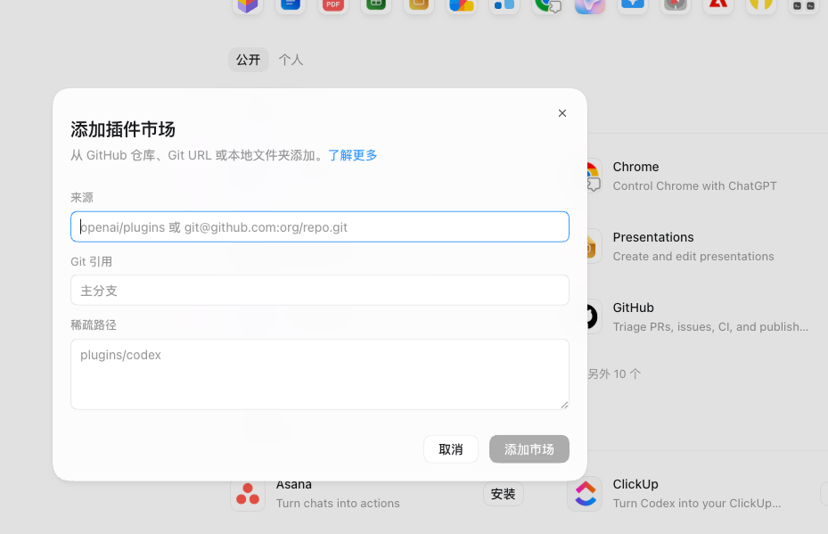

# Gewu: 3-Minute Getting Started Guide

<p>
  <a href="./GETTING_STARTED.md">简体中文</a>
  ·
  <a href="./GETTING_STARTED_EN.md"><strong>English</strong></a>
</p>

This guide has one goal: take you from discovering Gewu to completing your first successful investigation.

## What Gewu gives you

Give Gewu a link, repository, article, screenshot, or product clue. It will try to:

1. Inspect the material that matters to the decision
2. Find the official site, original repository, or first-party publisher
3. Separate verified facts, source claims, reasonable inferences, and unverified items
4. Recommend whether to use, test, reproduce, extend, monitor, or stop pursuing it

Gewu is not a webpage summarizer. Its goal is to produce an actionable judgment.

## Option 1: Install the plugin in Codex / ChatGPT Work

This is the easiest installation route.

### Step 1: Add the Gewu marketplace

Open **Plugins → Add plugin marketplace** and enter:

| Field | Value |
| --- | --- |
| Source | `wuxie888/gewu` |
| Git reference | `main` |
| Sparse path | Leave blank |



Select **Add marketplace**.

The dialog is an official Codex capability, but a manually added Git marketplace is a third-party supply chain and is not automatically endorsed through OpenAI directory review. Before adding it, confirm:

- The source is exactly [`wuxie888/gewu`](https://github.com/wuxie888/gewu)
- The public repository, publisher, commit history, and manifest match this project
- Gewu currently contains only `skills/`, with no App, MCP server, hook, account login, or remote service

Use `main` during the candidate stage to receive current fixes. After a stable release, pin a stable tag or full commit SHA when reproducibility matters more.

### Step 2: Install Gewu

Find **格物 · Gewu** in the marketplace you just added, then select **Install**.

You can also use the CLI:

```bash
codex plugin marketplace add wuxie888/gewu
codex plugin add gewu@gewu
```

### Step 3: Start a new task

After installation, create a new Codex / ChatGPT Work task. Existing tasks do not automatically reload newly installed plugins.

Invoke Gewu explicitly:

- Codex: type `$gewu` or select **格物 · Gewu** from the Skill picker
- ChatGPT Work: if **格物 · Gewu** appears in the `@` menu, select it there

Before sending, confirm that `$gewu` or the selected Gewu Skill appears in the composer. A response that merely looks like a research report does not prove that the plugin was loaded.

## Complete your first investigation

Copy this prompt and replace the final URL:

```text
$gewu Inspect this link completely. Tell me what it is, where the first-party source is, which claims are verified, and whether it is worth further investigation:
https://example.com
```

For your first run, use a publicly accessible product site, GitHub repository, or article. Login gates, CAPTCHAs, regional restrictions, and browser security policies may force a degraded investigation.

## How to tell whether Gewu is working

A normal Gewu report usually includes:

- **Scope**: pages, images, replies, links, source files, or documents inspected
- **Object and origin**: what it is and where the first-party source lives
- **Evidence levels**: direct observations, source claims, inferences, and unknowns
- **Teardown**: product, technical, design, writing, or business analysis
- **Verdict**: use, test, reproduce, extend, monitor, or stop
- **Limits**: what could not be inspected and why

When the source cannot be opened, Gewu should label the result as a degraded investigation instead of claiming a complete review.

## Prompts you can copy

### Product website

```text
$gewu Inspect this product website completely. Break down its functionality, interaction design, and business model, then decide whether it is worth using.
```

### GitHub repository

```text
$gewu Investigate this GitHub repository: source, license, maintenance status, and real implementation completeness. Decide whether it is suitable for further development.
```

### Article or X post

```text
$gewu Read this article completely, including decision-critical images, quotes, replies, and outbound links. Evaluate the feasibility of the projects it mentions.
```

### Hidden product source

```text
$gewu The article hides the product name. Trace the original project from screenshots, logos, interface text, and feature descriptions, then cross-check the match.
```

### Writing teardown

```text
$gewu Break down this article's structure, narrative rhythm, evidence use, and distribution method. Give me an actionable framework without copying protected text.
```

### Quick decision

```text
$gewu Make a quick judgment about whether this deserves further research. A full investigation is not required, but state the current evidence limits.
```

## Option 2: Install the Skill in another Agent

The portable core is the entire [`skills/gewu/`](../skills/gewu/) directory.

1. Copy it to the target Agent's Skills or Instructions directory
2. If the platform has no native Skill mechanism, load `SKILL.md` as system or developer instructions
3. Make sure the Agent can read `references/` through relative paths
4. Invoke it explicitly through `gewu`, `格物`, or the platform's Skill picker

Installation paths and invocation syntax vary by Agent, but Gewu's investigation and evidence rules are not tied to Codex.

## Troubleshooting

Read [Troubleshooting](./TROUBLESHOOTING_EN.md) first. If the problem remains, open a [GitHub Issue](https://github.com/wuxie888/gewu/issues) with:

- Platform and version
- Installation method
- Invocation method
- Actual error
- A public reproduction link

Never include private links, accounts, cookies, API keys, or other secrets in an issue.
